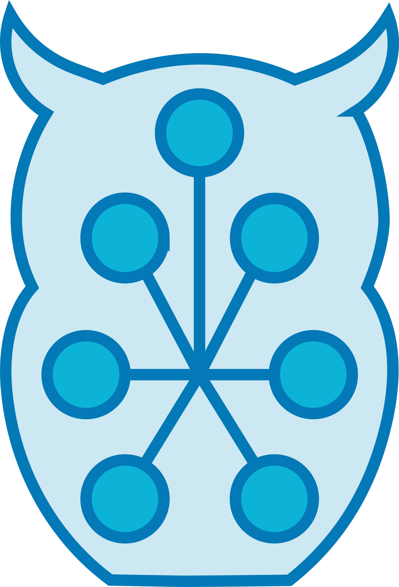

#  HOnK (Hub Ontology for Knowledge)

Project for combining multiple knowledge bases into one unified ontology, to aid research in achieving better type resolution for work carried out in [LaSSI](https://github.com/LogDS/LaSSI).

## Setting Up
### 1. Database (PostgreSQL)
PostgreSQL must be installed, along with a database and user:

#### Installation
*Linux (Ubuntu tested)*
```bash
sudo apt install postgresql -y
sudo -u postgres psql
```

*macOS*
```bash
brew install postgresql
psql postgres
```

#### Setup
```postgresql
create database ontology_db;
create user fox with encrypted password 'drowssap';
grant all privileges on database ontology_db to fox;
\c ontology_db fox
grant all on schema public to fox;
exit
```

### 2. Getting Supporting Files
The following knowledge bases are used. The download script fetches and extracts all files in the correct format:
```bash
./download_knowledge.sh
```
Files used in our experiments can also be found at OSF.io: https://osf.io/8mqs4/?view_only=282c38027c8043d5abd76a98001c31fa

#### Knowledge Bases

| KB | Description | Status |
|----|-------------|--------|
| [Parmenides](supporting_files/parmenides/) | Structured linguistic/logical resource providing nouns, verbs, adjectives, locations, dependency roles, and typed inter-concept relations for NLP type resolution | Active (default) |
| [ConceptNet](https://github.com/commonsense/conceptnet5/) | Commonsense relational knowledge; single CSV built from the ConceptNet 5 codebase, build dated 2025-09-20 | Active |
| [Wiktionary](https://github.com/tatuylonen/wiktextract) | Pre-expanded definitions, POS tags, lemmas, and derived/related terms; filtered to English, from 2026-03-03 | Active |
| [WordNet](https://doi.org/10.5281/zenodo.3739540) | Lexical relations and synsets; used as a ConceptNet input to improve clustering | Active |
| [GeoNames](https://download.geonames.org/export/dump/) | Geographic entities, feature hierarchy, and alternate names | Active |
| [DBpedia](https://databus.dbpedia.org/dbpedia-enterprise/en-dbpedia-enriched-with-wikidata-dbpedia) | Entity labels, types, and properties enriched with Wikidata (dump 2025-08-21; truthy dump 2025-10-24) | Work in progress |

### 3. Install Packages and Run
Set up a virtual Python environment (3.10.x and 3.11.x tested), then:
```bash
pip install .
build-ontology
```

With optional arguments:
```bash
build-ontology --config custom_config.yaml --run-id 0
```

## Pipeline Overview
The pipeline is orchestrated by [`build_ontology.py`](build_ontology.py) and configured via [`config.yaml`](config.yaml). It runs in two interchangeable modes controlled by `general.mode`:

| Mode | Storage | Use case |
|------|---------|----------|
| `db` | PostgreSQL | Default; scalable to large KB combinations |
| `graph` | In-memory RDF | Faster feedback; no database required |

The graph backend is selected via `graph.type`: `oxigraph` (Pyoxigraph, preferred) or `rdf` (RDFLib).

### Stages

#### 1. Ingestion
Loaders in [`knowledge_bases/`](knowledge_bases/) parse source files and write concepts, relations, properties, and external URLs. In `db` mode data goes to PostgreSQL; in `graph` mode it goes directly into the in-memory store. Results are pickled to `.cache/` when `should_cache: true` to allow incremental re-runs.

#### 2. Clustering
Groups concepts that refer to the same real-world entity using shared external URLs. An adjacency list is built from co-occurring URLs, then transitive closure identifies connected components. In `db` mode this produces `clusters` and `cluster_relations` tables ([`clustering/cluster_concepts.py`](clustering/cluster_concepts.py)); in `graph` mode the graph is modified in place ([`clustering/cluster_graph_concepts_oxi.py`](clustering/cluster_graph_concepts_oxi.py) / [`_rdf.py`](clustering/cluster_graph_concepts_rdf.py)).

##### Merge-precision refinements
Three refinements constrain the merge so that it is precise rather than purely coverage-driven, preventing surface-lemma collisions from merging unrelated senses. They are applied in both execution modes.

- **Sense-aware concept identity** — a concept is keyed by `(term, POS, sense)` rather than by `(term, POS)`, so distinct senses of a lemma stay distinct nodes and never pool one another's external URLs. The sense token is source-provided: ConceptNet's disambiguation suffix (e.g. `n/wn/act`), WordNet's lexical domain (e.g. `noun.location`), and GeoNames' `geonameid`. It is stored verbatim and deliberately not normalised, so concept identity is stable across the `general.normalisation` modes. In `db` mode this is the `concepts` uniqueness key; in `graph` mode it is encoded in the concept URI ([`graph/graph_funcs.py`](graph/graph_funcs.py)).
- **Type-coherence merge guard** — before a URL-connected component is committed as a cluster, its members are partitioned by WordNet supersense (`GraphManager.supersense_of_sense`). A component spanning two or more disjoint supersenses is split along those boundaries instead of merged, so a shared URL cannot merge type-incoherent senses. Members whose sense yields no supersense are unaffected ([`clustering/cluster_graph_concepts.py`](clustering/cluster_graph_concepts.py)).
- **Structural self-loop filter** — any edge under a structural irreflexive relation (`partOf`, `isA`, `instanceOf`) whose endpoints share a normalised label is removed, since a same-label merge can otherwise materialise a degenerate `X partOf X`. In the graph modes this is a post-hoc pass over the finished graph (`remove_structural_self_loops`); in `db` mode the condition is enforced at ingestion, guarded by the sense discriminator so genuine edges between two distinct senses are retained.

#### 3. Graph Construction
In `db` mode, [`build_ontology.py`](build_ontology.py) reads the database tables and converts rows to RDF triples via the `GraphManager`. In `graph` mode the store is already populated after ingestion and clustering. POS tag classes are added at this stage.

#### 4. Serialisation
The graph is exported to `.nt` (N-Triples) or optionally converted to `.ttl` (Turtle) via `rapper`. The base URI and namespace prefix are set in the `turtle_export` section of `config.yaml`.

#### 5. Benchmarking
A `@timer` decorator ([`tools/timer.py`](tools/timer.py)) wraps each pipeline stage to capture wall time and peak memory. Results accumulate in a `Benchmark` instance and are exported to CSVs in [`benchmarking/results/`](benchmarking/results/).

### Configuration
Key sections of `config.yaml`:

| Key | Description |
|-----|-------------|
| `general.sources` | List of KBs to load (shipped default: all five — `['parmenides', 'conceptnet', 'wiktionary', 'wordnet', 'geonames']`) |
| `general.mapping_sources` | KBs used for edge-type mappings (default: `['wordnet', 'conceptnet', 'wiktionary']`) |
| `general.mode` | `'db'` or `'graph'` |
| `general.normalisation` | `'full'` (HOnK POS + edge mappings), `'raw'` (none), or `'canonicalise'` (lowercase + lemma only, no HOnK mappings); drives the method-versus-data ablation |
| `graph.type` | `'oxigraph'` or `'rdf'` |
| `clustering.enabled` | Toggle clustering stage |
| `db_config.clear_db_on_start` | Drop and recreate tables on each run |
| `turtle_export.convert` | Convert output `.nt` to `.ttl` after serialisation |

### DB Schema (DB mode)
Tables are created automatically. `clear_db_on_start: true` drops and recreates them before each run.

| Table | Description |
|-------|-------------|
| `concepts` | `(id, term, part_of_speech, sense, source)`, unique on `(term, part_of_speech, sense)` — see [Merge-precision refinements](#merge-precision-refinements) |
| `relations` | `(start_concept_id, end_concept_id, relation_type, weight, source)` |
| `properties` | `(concept_id, type, value, source)` |
| `urls` | `(concept_id, external_url, source)` |
| `clusters` | `(concept_id, cluster_id)` — added when clustering is enabled |
| `cluster_relations` | `(start_cluster_id, end_cluster_id, relation_type, weight)` — added when clustering is enabled |

## Evaluation
The [`evaluator/`](evaluator/) pipeline compares HOnK against a ConceptNet-only baseline over a benchmark of 100 test sentences (15 hand-curated, 65 differential-seeded, 20 neutral controls) at three tiers:

1. **Deterministic** — graph-theoretic metrics (volume, hit rate, keyword connectivity, bridging, relation diversity, path length)
2. **Semantic** — per-triple embedding similarity using Sentence Transformers across three models
3. **LLM-as-judge** — three locally hosted models via Ollama score context relevance; paired Wilcoxon significance, effect sizes, and cross-judge agreement (Krippendorff's alpha) are reported

`honk_evaluator.py` is the entry point. Supporting drivers and utilities:

| Script | Purpose |
|--------|---------|
| `extractor.py` | Builds the subgraph context around each test sentence |
| `reporter.py` | Produces the CSV exports and LaTeX tables |
| `regenerate_tables.py` | Rebuilds every table from existing result CSVs, without re-running the embedding/LLM phases |
| `generate_paper_tables.py` | Rebuilds `paper_tables/` from `evaluation_results.csv` |
| `run_context_sweep.py` | Equal-context ablation at matched retrieval budgets of 50/100/200 triples |
| `run_ablation_downstream.py` | Per-arm and clustering-isolation downstream retrieval runs, each scored against a fixed baseline arm |
| `build_ablation_downstream_table.py` | Aggregates those per-arm CSVs into the downstream method-versus-data table |
| `pair_miner.py` | Fast keyword-pair miner that produces [`evaluator/mined_pairs.yaml`](evaluator/mined_pairs.yaml) for benchmark seeding |
| `sentence_suggester.py`, `triple_sampler.py` | Benchmark-construction helpers |

Benchmark sentences, models, and thresholds live in the `evaluator` section of a config file. `honk_evaluator.py` defaults to [`config.yaml`](config.yaml) (auto-detected from the working directory or its parent; `--config` overrides), and `generate_paper_tables.py` treats `config.yaml` as the source of truth for sentence labels and provenance. `run_ablation_downstream.py` prefers [`eval_config.yaml`](eval_config.yaml) and falls back to `config.yaml`. Both files currently carry the same 100 test cases.

The `evaluator`, `graph`, and `tools` directories are not installed packages (see `[tool.setuptools] packages` in [`pyproject.toml`](pyproject.toml)), so `pip install .` does not put them on the path. Run the evaluator scripts from inside `evaluator/` with the repo root on `PYTHONPATH`:

```bash
cd evaluator && PYTHONPATH=.. ../.venv/bin/python honk_evaluator.py
```

### Fidelity audit
A direct, provenance-linked audit measures semantic fidelity on 150 stratified outputs (POS mappings, relation mappings, URL-based merges, enriched cluster relations). `provenance_audit_sampler.py` draws the sample with links back to source evidence, `provenance_audit_adjudicator.py` re-verifies each row deterministically, `apply_fidelity_labels.py` records the manual labels (criteria in [`evaluator/FIDELITY_LABELLING.md`](evaluator/FIDELITY_LABELLING.md)), and `fidelity_analysis.py` computes per-stratum fidelity with Wilson intervals and the false-merge rate.

`fidelity_analysis.py` can also report test-retest agreement, but **this was not performed for v1.5.0**: the shipped `fidelity_audit_retest.csv` was drawn from the pre-fix sample and shares none of its rows with the current post-fix sample, so the agreement section prints nothing rather than failing. See the warning in [`evaluator/FIDELITY_LABELLING.md`](evaluator/FIDELITY_LABELLING.md) before relying on it.

## Multi-run Experiments
[`run_experiments.py`](run_experiments.py) reads per-run config overrides from [`configurations.json`](configurations.json) and merges them with `config.yaml` to produce isolated temporary configs. [`run_iterations.sh`](run_iterations.sh) drives batch execution across multiple iterations.

```bash
python run_experiments.py --iteration 0 --config-index 0
./run_iterations.sh
```

Additional override sets: [`configurations_ablation.json`](configurations_ablation.json) builds the five method-versus-data ablation arms (ConceptNet-only, raw union, canonicalised union, full unclustered, full clustered; select with `--configurations-file` and `--config-index 0..4`), and [`configurations_ontologies.json`](configurations_ontologies.json) rebuilds the ontology variants used for the intrinsic comparisons. [`configurations_intrinsic.json`](configurations_intrinsic.json) with [`regenerate_intrinsic.sh`](regenerate_intrinsic.sh) regenerates the intrinsic-comparison metrics from the built graphs. [`config_cn_only.yaml`](config_cn_only.yaml) is a standalone config for the ConceptNet-only graph. [`run_scalability_tests.sh`](run_scalability_tests.sh) runs the DB and graph clustering scalability tests.

## Supporting Tooling

| Path | Purpose |
|------|---------|
| [`tools/ablation_stats.py`](tools/ablation_stats.py) | Per-arm decomposition stats for the ablation, including navigability (largest connected component and reachability) |
| [`tools/validate_mappings.py`](tools/validate_mappings.py) | Checks every mapping rule's target against the canonical class set, so an ontology rename cannot silently break a mapping |
| [`tools/decompose_type_classes.py`](tools/decompose_type_classes.py) | Type-class decomposition behind the intrinsic comparison tables |
| [`tools/boomer/`](tools/boomer/) | Match-stage and merge-stage comparison against the standard ontology-matching pipeline: BERTMap (two base models) and similarity baselines against the curated reference alignment, plus Boomer coherence reports |
| [`clustering/reverse_engineer_clusters.py`](clustering/reverse_engineer_clusters.py) | Traces a cluster back to the shared URLs and source rows that produced it (usage in [`clustering/README.md`](clustering/README.md)) |
| [`slurm/`](slurm/) | HPC job scripts for the performance and scalability campaigns, with `hpc.env.example` and `pull_results.sh` |
| [`benchmarking/plot.py`](benchmarking/plot.py), [`benchmarking/plot_results.py`](benchmarking/plot_results.py) | Regenerate the benchmark tables and figures from the results CSVs |

## Testing
```bash
pytest tests/ -v
```

The primary correctness test, `test_graph_db_equivalence.py`, runs the full pipeline in both `db` and `graph` modes and compares the output triple-by-triple. The rest of the suite covers:

| Test | Covers |
|------|--------|
| `test_sense_identity.py` | Sense-aware concept identity |
| `test_type_coherence_guard.py` | Supersense derivation behind the type-coherence merge guard |
| `test_selfloop_filter.py` | Structural self-loop removal |
| `test_normalisation_modes.py` | The `full` / `raw` / `canonicalise` normalisation modes |
| `test_navigability.py` | Navigability metrics |
| `test_mappings.py` | POS and edge mapping resolution |
| `test_wiktionary_pos.py`, `test_conceptnet_parser.py` | Per-loader parsing behaviour |

## Future Work
- **DBpedia** — a streaming loader ([`knowledge_bases/dbpedia_loader.py`](knowledge_bases/dbpedia_loader.py)) implements the standard loader interface over the filtered label, type, and property dumps (48.77 GB, reduced from roughly 1 TB raw), so DBpedia would enter the same staging, normalisation, and clustering pipeline without structural changes. It is excluded from default runs because the encyclopaedic layer roughly doubles the input volume; see the paper's data-sources discussion for the full rationale.
